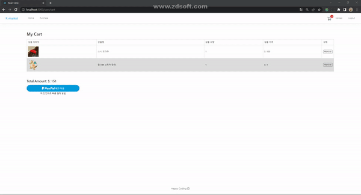

<h1 dir="auto"><a id="user-content-술-알고-마시자-술-추천-및-리뷰-서비스-주절주절" class="anchor" aria-hidden="true" href="#술-알고-마시자-술-추천-및-리뷰-서비스-주절주절"><svg class="octicon octicon-link" viewBox="0 0 16 16" version="1.1" width="16" height="16" aria-hidden="true"><path fill-rule="evenodd" d="M7.775 3.275a.75.75 0 001.06 1.06l1.25-1.25a2 2 0 112.83 2.83l-2.5 2.5a2 2 0 01-2.83 0 .75.75 0 00-1.06 1.06 3.5 3.5 0 004.95 0l2.5-2.5a3.5 3.5 0 00-4.95-4.95l-1.25 1.25zm-4.69 9.64a2 2 0 010-2.83l2.5-2.5a2 2 0 012.83 0 .75.75 0 001.06-1.06 3.5 3.5 0 00-4.95 0l-2.5 2.5a3.5 3.5 0 004.95 4.95l1.25-1.25a.75.75 0 00-1.06-1.06l-1.25 1.25a2 2 0 01-2.83 0z"></path></svg></a>R-market</h1>
<ul dir="auto">
<li>상품을 등록해보고 페이팔(Test) 결제 시스템까지 이용하실 수 있습니다.</li>
</ul>
 

## ⚡ Skills
 

- React 로 사용자와의 상호작용이 많은 웹 페이지를 효율적으로 구현하고 관리했습니다.
- Ant Design 라이브러리를 사용해 디자인을 제작했습니다. 
- Node.js 로 서버를 구축했습니다.
- 데이터 베이스는 MongoDB를 사용했습니다.
 

<h2 dir="auto"><a id="user-content--intro" class="anchor" aria-hidden="true" href="#-intro"><svg class="octicon octicon-link" viewBox="0 0 16 16" version="1.1" width="16" height="16" aria-hidden="true"><path fill-rule="evenodd" d="M7.775 3.275a.75.75 0 001.06 1.06l1.25-1.25a2 2 0 112.83 2.83l-2.5 2.5a2 2 0 01-2.83 0 .75.75 0 00-1.06 1.06 3.5 3.5 0 004.95 0l2.5-2.5a3.5 3.5 0 00-4.95-4.95l-1.25 1.25zm-4.69 9.64a2 2 0 010-2.83l2.5-2.5a2 2 0 012.83 0 .75.75 0 001.06-1.06 3.5 3.5 0 00-4.95 0l-2.5 2.5a3.5 3.5 0 004.95 4.95l1.25-1.25a.75.75 0 00-1.06-1.06l-1.25 1.25a2 2 0 01-2.83 0z"></path></svg></a><g-emoji class="g-emoji" alias="beers" fallback-src="https://github.githubassets.com/images/icons/emoji/unicode/1f37b.png">👀 Demo</h2>

|🏠 홈|🔍 상세|
|:---:|:---:|
|||
|📱 모바일|💵 결제|
|||
|✒️ 등록|📒 회원가입|
|||

